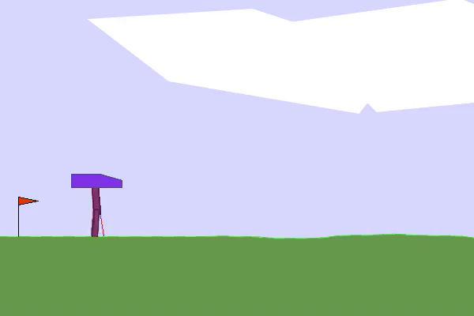
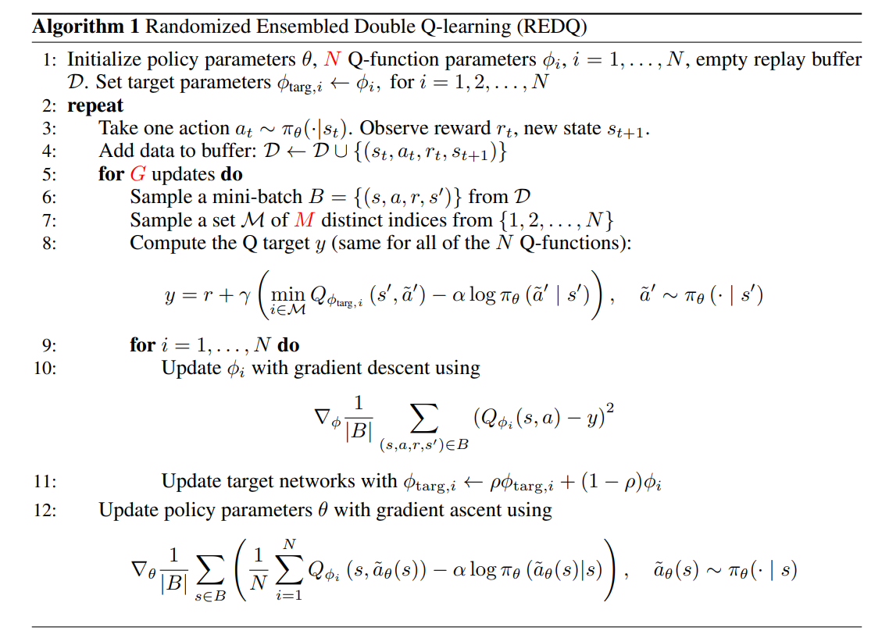
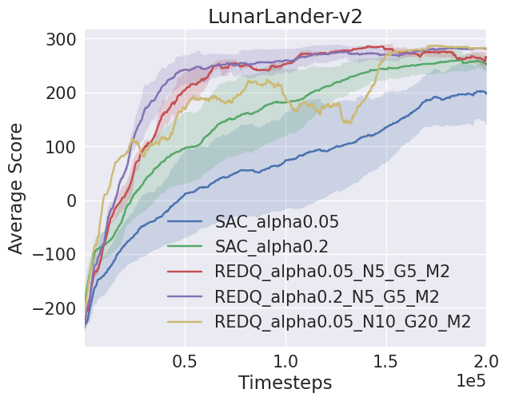

# REDQ Implementation
This repository provides a clean implementation of the Randomized Ensembled Double Q-learning (REDQ) [[paper]](https://arxiv.org/abs/2101.05982) algorithm, a model-free reinforcement learning algorithm that achieves high sample efficiency in continuous action space domains. The implementation is compatible with OpenAI Gym environments and includes comparison benchmarks against Soft Actor-Critic (SAC).
<p align="center">

</p>  

## Overview
REDQ is an enhancement over traditional off-policy algorithms, employing three key mechanisms:
- High Update-To-Data (UTD) ratio for improved sample efficiency
- Ensemble of Q-functions to reduce variance in Q-function estimates
- In-target minimization to reduce over-estimation bias

The pseudocode of the REDQ algorithm is as follows:
<p align="center">
  
</p>

The main hyperparameters of the REDQ algorithm are:
- G: Number of gradient steps per interaction
- N: Number of critic networks
- M: Size of the random subset over N critics

## Results
For the final conclusions see the report [here](docs/REDQ_report.pdf). Here you can see a summary of the results:
<p align="center">
  
</p>


## Usage example
In this example, we train the REDQ algorithm on the LunarLander-v2 environment with the following hyperparameters: N=5, G=5, M=2
```bash
python main.py --kwargs N=5 G=5 M=2 alpha=0.05 --exp_name REDQ_alpha0.05_N5_G5_M2 --total_timesteps 200000 --seed 1 --env LunarLander-v2
```

Furthermore, since Soft-Actor Critic (SAC) is subset of REDQ, we can also train the SAC algorithm with the following hyperparameters: N=2, G=1, M=2
```bash
python main.py --kwargs N=2 G=1 M=2 alpha=0.2 --exp_name SAC_alpha0.2 --total_timesteps 200000 --seed 42 --env LunarLander-v2
```

See the file `run_experiments.sh` for more examples.

If you want to plot the results see the notebook `show_plots.ipynb`.


## Installation
```bash
conda env create -f environment.yml
conda activate RL
```

## References
1. Chen, X., et al. (2021). "Randomized ensembled double q-learning: Learning fast without a model". arXiv preprint arXiv:2101.05982.
2. Haarnoja, T., et al. (2018). "Soft actor-critic: Off-policy maximum entropy deep reinforcement learning with a stochastic actor".

## Others
This repository was part of the course ATCI at UPC Barcelona. 
Authors:
- Lukas Meggle
- Alberto Maté